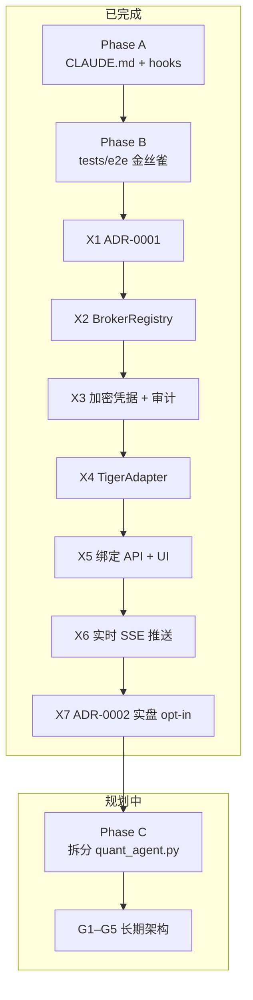

# Harness Coding 学习文档

> 本文档从本仓库（QuantAgent demo）中**摘出**所有与 **harness coding** 相关的内容，整理成可独立阅读的学习材料。  
> 起点提交：`c36a6f7` — *chore: bootstrap harness coding scaffold (phases A + B)*。

---

## 1. 什么是 Harness Coding

**Harness**（挽具 / 测试挽具）在软件工程里指：给难以直接验证的复杂系统套上**可重复、可自动化的护栏**，让人和 AI 都能安全地改代码。

在本项目中，**harness coding** 特指一套为 **LLM Agent 单体重构** 服务的工程方法：

| 问题 | Harness 的答法 |
|------|------------------|
| `quant_agent.py` 五千多行，一改就崩 | 先写 **金丝雀 e2e**，mock LLM，零网络 |
| AI 助手不懂交易安全边界 | **`CLAUDE.md`** 写死硬规则，改代码前必读 |
| 改 `.py` 引入语法错误才发现 | **PostToolUse hook** 保存后立刻 `py_compile` |
| 大功能（券商多租户）跨度大 | **分 Phase 提交**，每步 canary 保持绿 |

一句话：**先有保障，再动大石头**；保障包括文档约束、自动化检查、可重复的冒烟测试。

---

## 2. 与本项目相关的文件地图

下列文件/目录**全部**属于 harness coding 体系（或在其约束下演进）：

```
demo/
├── CLAUDE.md                 # Phase A：架构图、交易安全、G1–G5、禁区
├── .claude/settings.json     # Phase A：Edit/Write 后自动 py_compile
├── requirements-dev.txt      # Phase A：pytest（金丝雀依赖）
├── tests/e2e/                # Phase B：金丝雀（agent 循环）
│   ├── conftest.py           # scripted_llm、OpenAI chunk 构造器
│   └── test_smoke.py         # 2 个 hermetic 测试
├── docs/adr/                 # Phase X 的设计决策（路线图中的 X 系列）
│   ├── 0001-broker-abstraction.md
│   └── 0002-live-trading.md
└── tests/brokers/            # Phase X 子系统测试（与 canary 并列，非 e2e）
```

**不属于** harness 核心、但在 Phase X 中按同一原则交付的：`brokers/`、`server.py` 绑定 API、`static/brokers.html` 等——它们是「在护栏下做的业务」，ADR 里要求 **每步 commit、canary 全绿**。

**明确不是** harness 一部分：`agent_demo.py`（G1 要求淘汰的冗余入口）、`memory/episodic.py` 里的 “Phase 4” 注释（另一套功能分期，与 harness 路线图无关）。

---

## 3. 路线图总览



| 阶段 | 目标 | 本仓库状态 |
|------|------|------------|
| **A** | Agent 开发护栏（文档 + 工具链） | ✅ |
| **B** | 金丝雀冒烟（重构安全网） | ✅ |
| **X1–X7** | 券商抽象 / 多租户 / 实盘安全 | ✅（见 ADR） |
| **C** | `quant_agent.py` → `tools/` 模块化 | ⏳ 未开始（仍 ~5k 行，无 `tools/`） |
| **G1–G5** | 长期北极星（见 §8） | 持续约束 |

ADR 中的表述：

- X1：`docs/adr/0001-broker-abstraction.md` 开头 — *precedes the `quant_agent.py` decomposition in **Phase C***
- X 迁移：*Each step is its own commit, behind a **worktree**. **Canary stays green** at every commit.*
- X7：`docs/adr/0002-live-trading.md` — 实盘五层 opt-in

---

## 4. Phase A — 文档与即时反馈

### 4.1 `CLAUDE.md` 承担的角色

这是给 **Claude Code / Cursor 等 AI 编码助手** 的「项目宪法」，人类开发者同样应遵守。核心块：

1. **Run commands** — 如何启动服务、跑金丝雀、切 LangGraph
2. **Architecture** — 请求生命周期、`quant_agent.py` 关键符号表
3. **Known tech debt (G1–G5)** — 重构方向，禁止与之一对抗的改法
4. **Trading safety — hard rules** — 下单必须经过 intent → 用户确认；`risk_gate` 等
5. **Broker abstraction** — 与 ADR-0001/0002 对齐的多租户与实盘规则
6. **No-go zones** — `.env`、`risk_gate.py`、实盘 Alpaca URL 等

Harness 的意义：**在改五千行单体之前，先把「什么绝对不能动」写进仓库**，避免 AI 或新人「顺手优化」掉安全路径。

### 4.2 `.claude/settings.json` — PostToolUse Hook

每次 AI 对仓库执行 `Edit` / `Write` / `MultiEdit` 且目标是 `*.py` 时，自动：

```bash
python3 -m py_compile "<被编辑的文件>"
```

配置全文：

```1:17:.claude/settings.json
{
  "$schema": "https://json.schemastore.org/claude-code-settings.json",
  "hooks": {
    "PostToolUse": [
      {
        "matcher": "Edit|Write|MultiEdit",
        "hooks": [
          {
            "type": "command",
            "command": "f=$(jq -r \".tool_input.file_path // empty\"); case \"$f\" in *.py) python3 -m py_compile \"$f\" 2>&1 ;; esac",
            "timeout": 10
          }
        ]
      }
    ]
  }
}
```

**学习点**：Harness 不限于 pytest；**编辑反馈环**（保存即编译）能拦住大量低级错误，且对 LLM 工作流友好。

### 4.3 `requirements-dev.txt`

```text
pytest>=8.0
```

金丝雀只依赖 pytest；与 `requirements.txt` 的生产依赖分离，便于 CI / 本地快速装 dev 环境。

---

## 5. Phase B — 金丝雀测试（核心技能）

### 5.1 设计目标

来自 `tests/e2e/test_smoke.py` 文件头注释：

- 为 **G2**（拆分 `quant_agent.py`）提供 **safety net**
- **Hermetic**：patch LLM，**零网络**
- 唯一被调用的工具：`black_scholes`（纯数学，确定性）

若这两个测试在重构全程保持 **green**，则以下机制仍可用：

- system prompt 注入
- 消息列表处理
- 流式 chunk 累积
- `TOOL_REGISTRY` 分发
- generator 事件协议（`content_delta` / `tool_call` / `tool_result` / `final` / `error`）

### 5.2 如何运行

```bash
pip install -r requirements-dev.txt

# 全量金丝雀
python3 -m pytest tests/e2e/ -q

# 单测
python3 -m pytest tests/e2e/test_smoke.py::test_simple_chat_no_tools -q
python3 -m pytest tests/e2e/test_smoke.py::test_tool_dispatch_roundtrip -q
```

当前环境实测：约 **2 passed**，总耗时 ~5s（主要耗在 import chromadb 等，尚未纳入 canary 优化范围）。

### 5.3 `scripted_llm` 原理（必读）

`stream_quant_agent` 调用 `client.chat.completions.create(..., stream=True)` 并迭代 OpenAI 形态的 chunk。  
`conftest.py` 用 `monkeypatch` 替换 `create`，按**调用次序**返回预先写好的 chunk 列表。

关键辅助函数：

| 函数 | 模拟的行为 |
|------|------------|
| `content_chunk(text)` | 流式输出文本 |
| `stop_chunk()` | `finish_reason="stop"`，结束本轮 |
| `tool_call_chunk(...)` | 单次完整 tool_call delta |
| `tool_calls_finish_chunk()` | `finish_reason="tool_calls"` |

另：**关闭 follow-up LLM 调用**

```python
monkeypatch.setattr(quant_agent, "_generate_followups", lambda messages: [])
```

否则 `stop` 之后还会再打一次模型，金丝雀需要额外脚本，复杂度上升。

### 5.4 测试一：`test_simple_chat_no_tools`

**保护路径**：无工具、单轮、`finish_reason=stop`。

断言要点：

- 无 `error` 事件
- 至少一个 `content_delta`，恰好一个 `final`
- `final["text"]` 与 delta 拼接一致
- `messages` 末尾追加 assistant 消息
- 存在 `text_html`（markdown 渲染路径）

### 5.5 测试二：`test_tool_dispatch_roundtrip`

**保护路径**：一轮 tool_call + 二轮文本回答。

脚本两轮 LLM 响应：

1. 请求 `black_scholes`（参数 JSON）
2. 返回最终自然语言

断言要点：

- 1 个 `tool_call`、1 个 `tool_result`、1 个 `final`
- `theoretical_price` 在合理区间（~4.35 附近）
- `final["iterations"] == 2`
- 消息角色序列：`user → assistant(tool_calls) → tool → assistant`

### 5.6 何时扩展金丝雀

按 **G3**，每拆出一个工具模块，应增加**同类 hermetic 测例**（mock 外部 IO）。建议优先级：

1. 纯函数 / 纯计算工具（像 `black_scholes`）
2. 只读行情（mock HTTP / yfinance）
3. **交易类工具最后**——必须仍走 `OrderIntent`，且单独在 `tests/brokers/` 覆盖

**不要**在金丝雀里真连 DeepSeek、真下单。

---

## 6. Phase X — 在 Harness 约束下交付业务（案例）

Phase X 不是「.harness 文件」，而是 **应用同一方法论** 的大特性：券商 per-user 绑定、Tiger、实盘 opt-in、SSE 推送。

### 6.1 与 Harness 的契约（来自 ADR-0001 §9）

- **X2**：`BrokerRegistry`；工具层改解析路径；**canary 仍绿**
- **X3**：`credentials_store`、审计、加密；Alpaca 必须 bind
- **X4**：`tiger_adapter.py`；单测覆盖 paper 路径
- **X5**：REST + `/brokers` UI
- **X6**：`RealtimeStateStore` → `TigerPushHub` → `/api/broker/stream`
- **X7**：`live_orders_enabled` + ADR-0002 五层安全

工作方式：**独立 worktree、小步 commit、每步跑 `tests/e2e/`**。

### 6.2 并列测试：`tests/brokers/`

金丝雀**不**覆盖券商加密、KEK 轮换、实盘 422 等；这些由 `tests/brokers/`（约 20 个文件）负责。

学习区分：

| 层级 | 目录 | 测什么 |
|------|------|--------|
| Agent 挽具 | `tests/e2e/` | LLM 循环 + `TOOL_REGISTRY` 契约 |
| Broker 子系统 | `tests/brokers/` | 凭据、registry、Tiger、live flag、审计 |

改 `quant_agent` 编排 → 先 e2e。改 `brokers/` → `pytest tests/brokers/`。

### 6.3 交易安全作为 Harness 的「语义护栏」

以下规则写在 `CLAUDE.md`，**Phase X 期间不可削弱**（ADR-0001 §10）：

- LLM 工具只产生 `OrderIntent`，不得直接 `submit_order`
- 仅 `/api/broker/confirm-order/{id}` 在用户点击后提交
- `RISK_*` 是上限；禁止为通过风控扩大白名单
- 新交易工具必须加入 `TRADING_TOOLS`
- 实盘需五层同时满足（ADR-0002）；Alpaca live URL 仍禁止

Harness 不仅是测试，还包括 **「什么算正确行为」的规范文本**。

---

## 7. Phase C 与 G1–G5（规划中，但规则已生效）

### 7.1 Phase C 目标

将 `quant_agent.py`（当前约 **5200+ 行**）拆为：

```
tools/
  market/
  factors/
  technical/
  options/
  risk/
  trading/
  memory/
  registry.py      # TOOL_REGISTRY + TOOL_SCHEMAS
quant_agent.py     # <500 行，仅 stream_quant_agent + prompt 编排
```

**操作纪律**（建议）：

1. 从单体**剪切**一个工具到 `tools/...`，在 registry  re-export
2. 跑 `pytest tests/e2e/ -q`
3. commit；重复直到行数达标
4. 再抽 runner（配合 G4）

### 7.2 G1–G5 速查（`CLAUDE.md`）

| 编号 | 含义 |
|------|------|
| **G1** | 单一 agent 入口；不扩展 `agent_demo.py` |
| **G2** | 工具模块化；禁止继续往单体堆工具 |
| **G3** | 每工具 smoke test；网络必须 mock |
| **G4** | LLM 协议层可互换（DeepSeek / LangGraph / …） |
| **G5** | 鉴权只经 `auth/`；避免新的 thread-local / 硬编码工具集 |

---

## 8. 日常开发检查清单

开始改 agent / 工具前：

- [ ] 读过 `CLAUDE.md` 中与本次改动相关的节（交易 / broker / no-go）
- [ ] `python3 -m pytest tests/e2e/ -q` 基线全绿

改动过程中：

- [ ] 若动 `*.py`，依赖 hook 或手动 `py_compile`
- [ ] 不绕过 intent → confirm 流程
- [ ] 不把密钥、PEM 写进日志或 LLM 上下文

提交前：

- [ ] 再跑金丝雀
- [ ] 若动 `brokers/`：`pytest tests/brokers/ -q`
- [ ] PR 描述中说明是否触及 `risk_gate` / 实盘 / `TRADING_TOOLS`

---

## 9. 与 Cursor / Claude Code 的配合

| 机制 | 作用 |
|------|------|
| 根目录 `CLAUDE.md` | Cursor 也会作为项目规则读取（与 Claude Code 同源） |
| `.claude/settings.json` | Claude Code 专用 hooks |
| `docs/adr/*.md` | 重大架构变更的永久记录，Phase 编号锚点 |
| 提交信息里的 `(X7 B)` 等 | 可追溯子步骤，便于 bisect |

**学习建议**：在新仓库复制 harness 时，**最小集** = `CLAUDE.md`（安全+架构） + `tests/e2e`（2 个 hermetic 测） + `py_compile` hook；再按需加 ADR 与子系统测试。

---

## 10. 提交历史中的 Harness 锚点（便于 git 学习）

```text
c36a6f7  chore: bootstrap harness coding scaffold (phases A + B)
d317e3e  docs: ADR-0001 ... (phase X1)
1744be6  refactor(brokers): ... registry (X2 c1)
e641dc6  refactor(brokers): migrate ... BrokerRegistry (X2 c2)
dddbde0  feat(brokers): SQLite schema ... (X3 c1)
...
2812a3b  feat(brokers): RealtimeStateStore (X6 c1)
3cba707  docs+schema(X7 A): ADR-0002 ...
```

可用：

```bash
git log --oneline --grep="X[0-9]\|harness\|canary"
```

对照 ADR 与本文 Phase 表做 **考古式学习**。

---

## 11. 常见问题

**Q：金丝雀慢，要不要优化？**  
A：当前瓶颈是大模块 import（chromadb 等），与测试逻辑无关。优化 import 隔离是独立任务，不影响「是否保留金丝雀」的价值。

**Q：只有 2 个 e2e 够吗？**  
A：对 **编排层** 够用作回归雷达；工具行为需按 G3 逐步加 **单元/smoke**。交易路径靠 `tests/brokers/` + 人工 UI 确认。

**Q：`quant_agent_lg.py` 在 harness 里吗？**  
A：间接相关（G4）。切换 `USE_LANGGRAPH=1` 时，应保证同一 `TOOL_REGISTRY`；未来可为 LangGraph runner 加平行金丝雀，当前 e2e 只覆盖默认 `stream_quant_agent`。

**Q：文档里写的 `BROKER_MODE=alpaca` 还和 harness 一致吗？**  
A：ADR addendum 后 Alpaca 必须 per-user bind；`CLAUDE.md` 部分段落描述的是迁移前语义，以 **ADR-0001 addendum + registry 行为** 为准。

---

## 12. 延伸阅读（仓库内）

| 文档 | 内容 |
|------|------|
| [CLAUDE.md](../CLAUDE.md) | 完整护栏与命令 |
| [adr/0001-broker-abstraction.md](adr/0001-broker-abstraction.md) | Phase X 设计与迁移 |
| [adr/0002-live-trading.md](adr/0002-live-trading.md) | 实盘五层模型（X7） |
| [tests/e2e/test_smoke.py](../tests/e2e/test_smoke.py) | 金丝雀实现 |
| [tests/e2e/conftest.py](../tests/e2e/conftest.py) | scripted LLM _fixture |

---

## 13. 小结

**Harness coding** 在本项目中 = **文档宪法** + **编辑时编译** + **mock-LLM 金丝雀** + **分 Phase 小步提交** + **交易/券商 ADR 硬约束**。

已完成：A、B、X1–X7。  
下一步：**Phase C** 在金丝雀保护下拆分 `quant_agent.py`，落实 G2–G4。

掌握本文后，你应能：

1. 说清 harness 各文件的分工；  
2. 独立运行并理解两个 e2e 测试；  
3. 按同样模式为新工具/新 runner 加护栏；  
4. 在改 broker / 交易代码时知道该跑哪套测试、不能碰哪些红线。
